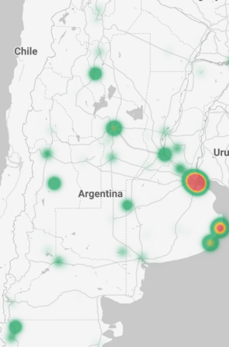

# _Google Big Query_

#### By _**Alejandro Socarras**_

#### _Unit 2, Week 2 Code Review_

## Description

_Assignment Instructions_

**Part 1: Big Query Python Client**
* Using Python, create a BigQuery client.

* In BigQuery (using the console or the command line), in the project that the client connects to, make a new dataset called 'plants'.

* Back in the Python file (or notebook), use the client to list the datasets in the BigQuery project. Confirm that the new 'plants' dataset is there.

* In a .sql file in the same repository as the Python code, write the SQL code that will create a table in the plants dataset called flower_shop. Give it a schema and insert values into it so it looks like this:

* Run the code from the .sql file in BigQuery, so it adds the new table to the plants dataset.

* Using Python, use .list_tables(), list the tables in the plants dataset, and confirm your new flower_shop table is there.

  
**Part 2: Looker Studio**
* In BigQuery, select a public dataset that interests you, and copy it to your project.

* Using Looker Studio, connect to the dataset and use it to make a visual.

* Add the visual from Looker Studio to your README. In the README, include a short description of the dataset, and what the visual is showing.

**Argentina Real Estate Heat Map (January 2018)**

The dataset I used to make the following heatmap can be found under Google Big Query's public data set collection as `properati-data-public.properties_ar`. The table I selected from this dataset contains real estate prices on listings from January 2018. As you can see, the most expensive listings are in Buenos Aires and in its surrounding beach towns of Pinamar and Mar del Plata. The larger green centers seen include secondary cities like Cordoba, Salta, Mendoza, and San Carlos de Bariloche. 

 

## Setup/Installation Requirements

_To run the project from your local system:_

1. Make a directory on your disk where you would like to clone the repo.

2. Copy the repo link: https://github.com/apsocarras/bigquery-looker.git (available if you click the green "Code" dropdown button on this page).

3. Open your terminal and change into the directory you made (`cd /path/to/new/directory`).

4. Type `git clone ` and paste the URL.

## Known Bugs

_No known bugs._

## License

_[MIT License](https://opensource.org/licenses/MIT)_

Copyright (c) _12.23.22_ Alejandro Socarras

Permission is hereby granted, free of charge, to any person obtaining a copy of this software and associated documentation files (the "Software"), to deal in the Software without restriction, including without limitation the rights to use, copy, modify, merge, publish, distribute, sublicense, and/or sell copies of the Software, and to permit persons to whom the Software is furnished to do so, subject to the following conditions:

The above copyright notice and this permission notice shall be included in all copies or substantial portions of the Software.

THE SOFTWARE IS PROVIDED "AS IS", WITHOUT WARRANTY OF ANY KIND, EXPRESS OR IMPLIED, INCLUDING BUT NOT LIMITED TO THE WARRANTIES OF MERCHANTABILITY, FITNESS FOR A PARTICULAR PURPOSE AND NONINFRINGEMENT. IN NO EVENT SHALL THE AUTHORS OR COPYRIGHT HOLDERS BE LIABLE FOR ANY CLAIM, DAMAGES OR OTHER LIABILITY, WHETHER IN AN ACTION OF CONTRACT, TORT OR OTHERWISE, ARISING FROM, OUT OF OR IN CONNECTION WITH THE SOFTWARE OR THE USE OR OTHER DEALINGS IN THE SOFTWARE.